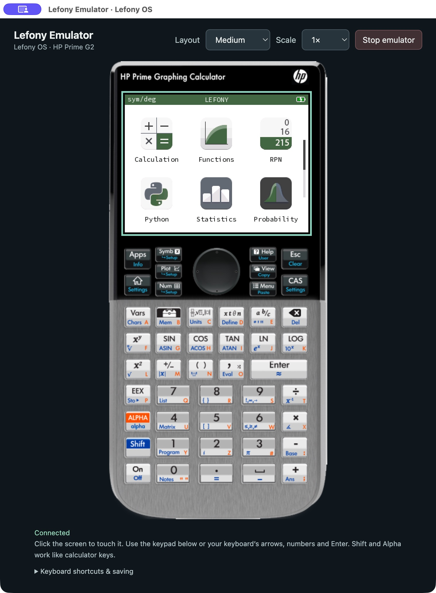
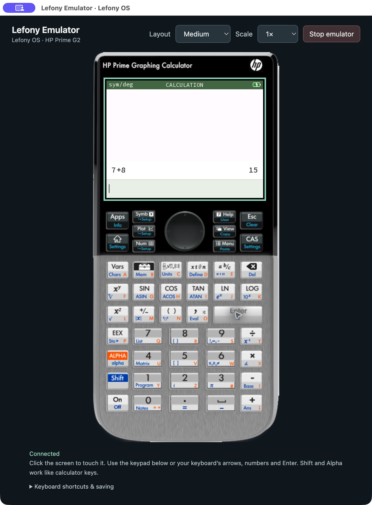

<p align="center"></p>

# Lefony OS

**A community-developed calculator OS for the HP Prime G2.**

Lefony brings Upsilon's calculator applications and Poincare math engine to the
Prime G2's native hardware, with a green-and-white interface, the Prime keyboard
layout, touch controls, and a host installer and emulator for development.

This repository contains the **native firmware port, installer/update tools,
Prime G2 QEMU models, tests, and development documentation**. The earlier Mahalo
Linux desktop and its obsolete deployment scripts are outside this project.

> **Development status:** native firmware boots on physical Prime G2 hardware.
> Changes are checked in an emulator, and physical acceptance is recorded
> separately. This is community firmware, not an HP-supported update. Prime G1
> is not a supported target.

## Latest updates — September 25, 2026

- **Native C/C++ SDK:** conventional `main`/newlib support, ARM emulator
  preview, input replay, GDB debugging, UI components and reference apps.
  See the [SDK guide](sdk/README.md) and
  [implementation ledger](docs/NATIVE-APP-SDK-1.0-PROGRESS.md).
- **App files and recovery:** streaming files, private-data backup/restore,
  retained app/data pairs, archives and developer-key management. See
  [file exchange](sdk/FILE-EXCHANGE.md) and [archives](sdk/ARCHIVES.md).
- **Faster transfers and startup:** recorded physical measurements show Doom
  installation falling from 735 to 106 seconds and a verified native OS update
  taking 4.9 seconds. Doom 0.2.3 also improves startup. See the
  [storage measurements](docs/STORAGE-SPEED-RELEASE-20260924.md) and
  [startup record](docs/DOOM-STARTUP-PERFORMANCE.md).
- **App installation and Home ordering:** the current firmware candidate adds
  an automatically dismissed progress screen and long-press app rearrangement
  with saved ordering. See the
  [implementation and validation record](docs/APP-INSTALL-AND-HOME-ORDER.md).
- **Shared desktop emulator:** the OS and SDK now use the same native window,
  complete Prime keyboard and live touchscreen. The shared wrapper targets
  macOS, Linux and Windows; no browser launch is used. See the
  [desktop setup and build guide](docs/EMULATOR-DESKTOP.md). The website’s macOS
  and Linux SDK downloads include this window and keyboard by default; see the
  [download release record](docs/DESKTOP-SDK-RELEASE-20260925.md).

SDK 1.0 remains in development. Source changes, downloadable bundles and
physical qualification have separate status; consult
[current status](docs/STATUS.md) before selecting a candidate. Native Windows
SDK distribution and broader hardware qualification remain unfinished.

## What works

- Calculator history with touch scrolling and expression/answer recall.
- Functions with touchable controls, one-finger graph panning and two-finger
  pinch zoom. Tap the bottom banner for plot options.
- Prime keypad layout, Shift/Alpha shortcuts and math templates.
- Native LCD rendering, brightness, refresh-rate trials with rollback, and
  battery/clock integration.
- Calculator, Functions, RPN, Python, statistics, probability, equation solver,
  periodic table, sequences, regression, and settings applications from Upsilon.
- A USB installer with build history, backups, verification, recovery handling,
  and signed-update support.
- A custom QEMU model for the Prime's display, input, PMIC, USB and NAND, plus
  automated application and hardware-model checks.

See [current status](docs/STATUS.md) for limitations and the distinction between
hardware-tested behavior and modeled behavior.

The [native SDK](sdk/README.md) builds and runs C/C++ app packages in
the emulator. It includes starter projects, `AGENTS.md`, drawing/input APIs and
automatic publication tooling, signed ABI 1 packages and USB installation.
Lefony reserves the fixed app region during OS startup, independently of the
website. The browser reads installed apps and free capacity, and installs packages. This retires the
stock HP filesystem and remains a development candidate awaiting hardware qualification.
See [implementation status](docs/NATIVE-APP-SDK-STATUS.md) and the
[SDK maturity roadmap](docs/NATIVE-APP-SDK-MATURITY-PLAN.md) for the path to a
complete developer platform. The [setup runbook](docs/NATIVE-APP-SETUP.md)
covers the website, signing keys, OAuth and local publication. The current
SDK candidate adds persistent synthetic workspaces, normal-input tests,
debugging and a small [Pocket Lab example](sdk/examples/pocket-lab/src/main.cpp).
See the [capability matrix](docs/NATIVE-APP-CAPABILITIES.md) for remaining gaps.
The [SDK 1.0 development plan](docs/NATIVE-APP-SDK-1.0-PLAN.md) focuses on
dependable C/C++ support, polished UI authoring and actual ARM emulator preview,
durable files and basic USB/HTTPS connectivity. Four proving applications guide
its milestones: Doom, Notebook, minigzip and Link Gallery. All four now have
local ARM emulator journeys; current source, complete downloadable bundles and
physical qualification have separate status in the SDK implementation ledger.

## Start contributing

You can work on the host tools and unit tests without owning a calculator,
without vendor firmware, and without connecting a USB device.

```sh
python3 -m venv .venv
. .venv/bin/activate
python -m pip install -r requirements-dev.txt
make test
make check-public
```

Use **Python 3.11 or newer**, Git, and a C/C++ compiler. Development is focused on
macOS and Linux. The installer uses a terminal UI; native Windows support is
not currently established.

Read [CONTRIBUTING.md](CONTRIBUTING.md) for the workflow and
[AGENTS.md](AGENTS.md) for guidance for coding agents. Useful starting areas
include touch interactions, installer usability, model accuracy, tests, and
clearer hardware documentation.

## Build the firmware

Successful main-branch builds are packaged automatically in
[GitHub Releases](https://github.com/maikopruett/Lefony-OS/releases), with signed
updates, emulator firmware, corresponding source and checksums. These are
development builds; see [release packaging](docs/RELEASES.md) for qualification
limits and the website's automatic latest-package discovery.

Install `arm-none-eabi-gcc`/`g++`, or use a running Docker engine for the
container build path. The scripts fetch the exact upstream revision recorded
in [UPSTREAM](ports/lefony-prime-g2/UPSTREAM).

```sh
make firmware       # Physical Prime G2 target; compile only
make firmware-vm    # Emulator target with test interfaces
```

Outputs are in `dist/`. The physical image is
`lefony-os-prime-g2-native.bin`; the emulator ELF is
`lefony-os-prime-g2-vm-native.elf`. The prepared Upsilon checkout under
`build/lefony-prime-g2/` is disposable: builds recreate it. Make durable changes
in the port, patches, or preparation scripts.

Settings → About → **Enter recovery mode** restarts through the installed
one-shot U-Boot. Press rear RESET again or wait three minutes to leave recovery;
normal Lefony startup follows. Older installations receive the bootloader through
the website's explicit recovery update. See [U-Boot recovery](docs/UBOOT-ONESHOT-RECOVERY.md).

**Building does not install or flash anything.** For bootable recovery capsules
and signed updates, see [the installer guide](docs/LEFONY-INSTALLER.md).

## Run the emulator

The OS launcher and SDK open the same desktop calculator window, with all 51
Prime keys, five layouts, whole-calculator scaling and a live 320 × 240 display.
The window embeds the renderer; it does not open a browser. It needs this
repository's Prime-specific QEMU models, which run the actual ARM firmware.

<p align="center">
  
  
</p>

Actual desktop-window screenshots from QEMU on macOS. These show the OS home
screen and a calculation entered with the clickable keypad.

```sh
make emulator       # Build pinned QEMU with the Prime G2 models
make firmware-vm
make run            # Native ELF fast path; no HP firmware required
```

QEMU build dependencies include Ninja, pkg-config, a C/C++ compiler, Python,
GLib and pixman development packages. Install `requirements-dev.txt` in `.venv`
for the emulator panel. Interactive launches include the HP Prime keyboard and
live display by default in a Qt desktop window on macOS, Linux and Windows.
Source installations need the pinned desktop dependencies; frozen SDK packages
include a native window bundle. See [desktop setup](docs/EMULATOR-DESKTOP.md)
for platform dependencies and [vm/README.md](vm/README.md) for headless operation,
keyboard/touch controls, test suites, and U-Boot boot-media modes.

The emulator's private-stock-fixture research tests are optional and clearly
separated from the firmware/unit-test workflow. HP ROMs, firmware archives,
NAND dumps, and vendor PDFs are not distributed here.

## Native app storage

Native apps use a shared [littlefs filesystem](docs/NATIVE-APP-STORAGE.md) in the
reserved 64 MiB region. Files consume space according to their size, with flash
allocation and update overhead; there is no eight-app slot limit. OS startup
migrates existing profile-1 apps and saved data. This source change remains a
development candidate requiring physical storage qualification.

## Installer

```sh
python3 scripts/lefony_installer.py --help
python3 scripts/lefony_installer.py --once --json  # Detect/report only
python3 scripts/lefony_installer.py              # Interactive installer
```

Hardware operations additionally need `libusb`, NXP's `uuu` tool, and the
recovery assets described in the [installer guide](docs/LEFONY-INSTALLER.md).
Prepare backups and a verified recovery path before installing development
firmware. A/B updates require a provisioned, qualified layout; normal updates
do not repartition an unprovisioned calculator.

## Repository map

| Directory | Contents |
| --- | --- |
| `ports/lefony-prime-g2/` | Native Ion drivers, app overlays, theme, upstream patches and build definitions |
| `native/prime_g2/` | Boot capsule, one-shot U-Boot recovery and NAND layout |
| `scripts/` | Firmware builds, preparation, installer, signing, history and diagnostics |
| `vm/` | QEMU board models, emulator runners, boot media and integration tests |
| `sdk/` | Experimental native C/C++ SDK, templates, examples and publisher tools |
| `tests/` | Host tests and explicitly public emulator signing fixtures |
| `hardware/prime_g2/` | Register contracts, measured facts, and hardware qualification notes |
| `docs/` | Architecture, contributor guides, installer and technical references |

Generated files and local signing keys live in ignored directories. See
[the migration notes](docs/MIGRATION.md) for the move from Mahalo OS and names
retained for storage/protocol compatibility.

## Licensing and credits

The complete OS is **source-available with a noncommercial restriction** because
its pinned Upsilon core is under **CC BY-NC-SA 4.0**. Contributions to the core
retain that license. It would be inaccurate to call the complete firmware
OSI-approved open source.

Lefony's original standalone installer and host tools are **GPL-3.0-or-later**.
QEMU and U-Boot integrations retain their **GPL-2.0-or-later** notices. Embedded
upstream code and third-party components retain their own terms; see
[LICENSE.md](LICENSE.md) and [THIRD_PARTY_NOTICES.md](THIRD_PARTY_NOTICES.md).

Lefony builds on [Upsilon](https://github.com/UpsilonNumworks/Upsilon), the
NumWorks/Epsilon lineage, [QEMU](https://www.qemu.org/), U-Boot, and the public
HP Prime hardware work cited in the repository. HP, NumWorks, Upsilon and other
third-party names and marks belong to their respective owners. This project
is not affiliated with or endorsed by HP or NumWorks.
