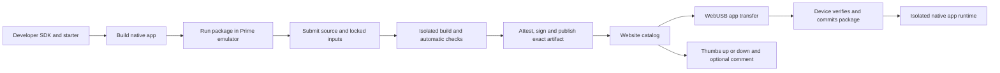

# Native app SDK and public store development plan

> Historical architecture plan. The [SDK maturity roadmap](NATIVE-APP-SDK-MATURITY-PLAN.md)
> supersedes its remaining-work priorities and server-validation assumptions.
> The current direction keeps community app builds and tests on developers'
> computers, with automatic publication and no routine manual approval.

> Implementation has begun. See [current implementation status](NATIVE-APP-SDK-STATUS.md)
> for shipped local code, qualification evidence and remaining gates. The
> architecture below is the full target, not a claim that all milestones are complete.

Status: implementation in progress, 2026-09-11. This document describes the full
target; the linked status report identifies what is implemented and tested.
Names and commands labeled proposed are design targets, not available tools.

## 1. Product requirements

Build a native C++ application platform for the HP Prime G2 running Lefony OS.
Applications should offer the responsiveness and integrated UI of Calculator,
Functions, and Statistics, install independently of firmware, and launch from
the calculator home screen.

The website provides a public app store and a Developers entry point. Developers
download an SDK and emulator, build and test an application locally, and submit
it for automatic technical validation and publication. There is **no routine
manual application approval or release approval**. Every published app page has
thumbs-up and thumbs-down buttons and an optional user comment. User feedback
assesses app quality; technical validation enforces the platform contract.

Keep SDK sources with the OS initially. Distribute standalone SDK bundles and a
separate starter-template repository so application authors do not need an OS
checkout. Authors own their application repositories. Maintain one canonical
template in the OS repository and generate the external template from it.

Scope decisions:

- Native C++ apps only; no Python app submission or script execution format.
  This project does not remove the existing built-in Python application.
- One foreground third-party app at a time for v1; no background services,
  app-provided kernel modules, direct hardware access, or native plugins inside
  other apps.
- Applications use a supported SDK rather than private OS headers or addresses.
- Installation, update, removal, and app-data backup are separate from firmware
  updates. Preserve existing firmware trust roots and update safeguards.
- Browsing and installation do not require a store account. Publishing and
  rating/commenting do require an account.
- Recommended initial submission policy: source plus locked build inputs;
  the service builds the artifact it distributes. Binary-only submission is
  deferred. This is a planning default, not an existing license policy.
- Start with free distribution. Payments and publisher monetization are outside
  this plan; component licensing must be resolved before making promises.

## 2. Current implementation and gaps

| Area | Evidence in this checkout | Required work |
| --- | --- | --- |
| Built-in applications | [Platform build](../ports/lefony-prime-g2/build/platform.prime_g2.mak) lists apps linked into the firmware | Independently loadable app runtime and home-screen integration |
| External applications | [Platform entry point](../ports/lefony-prime-g2/ion/src/prime_g2/platform.cpp) returns null for external app flash | Define a Lefony package and loader; do not advertise upstream external binary compatibility |
| Memory protection | [Memory initialization](../ports/lefony-prime-g2/ion/src/prime_g2/system.cpp) installs privileged mappings and code/data protections | Unprivileged app execution, per-app mappings, system calls, scheduling and fault recovery |
| Exceptions | [Runtime](../ports/lefony-prime-g2/ion/src/prime_g2/boot/runtime.cpp) reports fatal exceptions and halts diagnostically | Distinguish app faults from kernel faults; terminate an app and return to the shell |
| Physical persistence | [Status](STATUS.md) says application persistence remains RAM-only | Qualified durable package and app-data storage with a versioned layout plan |
| VM persistence | [Block storage](../ports/lefony-prime-g2/ion/src/prime_g2/block_storage.cpp) supports a modeled SD path | Equivalent app-store transaction semantics on a public VM fixture |
| USB | [USB implementation](../ports/lefony-prime-g2/ion/src/prime_g2/usb_diagnostics.cpp) implements diagnostics and update management | A bounded, versioned app-management protocol with independent action boundaries |
| Emulator | [VM guide](../vm/README.md) documents public direct boot, test input, and extended storage modes | Downloadable developer kit and convenient persistent app development mode |
| Releases | [Release guide](RELEASES.md) documents tagged manifests and website discovery | Versioned SDK releases, app provenance, catalog and submission service |

The upstream generated checkout contains an external-app API, but it is not the
Prime port's supported runtime. Its display assumptions and low-level memory
operations need evaluation, not wholesale adoption. Generated files under
`build/` are inspection inputs, never the location for durable implementation.

Existing MMU setup does not establish third-party isolation. Existing direct
VM boot also does not provide persistent SD storage. Both gaps must remain
visible in developer documentation until their respective milestones pass.

## 3. End-to-end architecture



Publication signatures mean that an artifact came through the defined service
and technical policy. They do not mean a person reviewed it or that it is free
of bugs. Low ratings do not block publication, trigger signing decisions, or
automatically uninstall an app. The calculator enforces isolation regardless
of an app's popularity, source availability, or signature.

## 4. Native execution model

### 4.1 Protection and lifecycle

Use a small unprivileged native app runtime within the existing firmware. Keep
OS drivers, USB, storage, interrupts, and framebuffer presentation privileged.
This is substantial firmware work, not a packaging-only change.

Before opening public native installation, demonstrate:

- App code is executable and read-only; app data, heap, and stack are writable
  and non-executable. Guard regions detect stack overrun.
- Apps cannot read/write kernel memory, other apps' data, peripheral registers,
  page tables, firmware slots, or release credentials.
- Service calls validate lengths, ranges, handle ownership, integer overflow,
  and pointer lifetime. Copy or explicitly pin buffers; do not trust app pointers
  across asynchronous work or termination.
- A timer can regain OS control from an infinite app loop. Apps cannot disable
  interrupts or service the hardware watchdog to hide a hang. Kernel service
  work is bounded too; a timer alone does not fix a hung privileged operation.
- Fault entry saves the required CPU state and safely returns to the launcher
  after reclaiming app resources. Kernel faults retain diagnostic treatment.
- Floating-point state, caches, TLBs, instruction cache synchronization, and
  exception stacks are handled explicitly when switching or loading code.
- OS-owned exit controls remain available. A failed app does not auto-relaunch
  at boot; repeated failures quarantine that installed version locally, with
  retry, uninstall, and app-data export available.

Proposed lifecycle: load, initialize, deliver input/timer events, render, suspend,
resume, request close, terminate. Normal shutdown may save state with a bounded
deadline. Forced termination must not depend on the app cooperating. Persist
only validated data; do not serialize live pointers or process memory.

Begin with one fixed virtual app address range reused by the single foreground
app. Determine the range from a memory reservation audit; do not invent physical
addresses or consume boot/recovery buffers opportunistically. This permits a
simple fixed-virtual-address ELF subset initially, without general dynamic
linking. Record supported segment types, alignment and entry rules in a format
specification. Reject all unsupported relocations, interpreters and imports.

### 4.2 C++ developer interface and binary boundary

Expose ergonomic C++ classes in the SDK, backed by a small C-compatible system
call contract: fixed-width fields, explicit structure sizes, opaque handles,
status codes, and version negotiation. Do not pass C++ objects, virtual tables,
exceptions, allocators, or STL containers across the privilege boundary.

For v1, statically link the supported app runtime and UI library into each app.
Pin compiler, linker, CPU instruction profile, floating-point ABI, C++ language
level, and library configuration. Disable exceptions and RTTI initially unless
the first feasibility work demonstrates and specifies a necessary alternative.
Provide explicit allocation-failure handling. No arbitrary shared libraries,
dynamic code generation, or downloaded executable dependencies in v1.

Separate these version identifiers:

| Identifier | Purpose |
| --- | --- |
| Package schema | Safe container parsing |
| Runtime ABI major/minor | Binary compatibility and service availability |
| SDK release and toolchain digest | Reproducible developer builds |
| OS release/build | Device diagnostics and tested compatibility |
| App version and immutable release ID | Updates, ratings context and rollback |
| App-data schema | Data migration independent of executable version |

Initially require an exact supported ABI major and sufficient minor capabilities.
Keep old binaries working across compatible OS releases using contract tests.
If an OS update would strand installed apps, show compatibility results before
the update and preserve their data. Do not use a minimum OS version as a
substitute for an actual binary compatibility contract.

Arm's official [ABI repository](https://github.com/ARM-software/abi-aa) is the
reference for calling conventions and ELF/runtime requirements. Record the
specific revision selected for the SDK; this plan does not change upstream pins.

### 4.3 UI, math and data APIs

Make the first useful SDK support:

| API group | Initial contract |
| --- | --- |
| Application | Lifecycle, metadata, localized strings and icon |
| Navigation | Views, focus, stacks, tabs, back/exit and modal cancellation |
| UI controls | Labels, buttons, menus, lists, tables, text and numeric fields |
| Drawing | Clipped surfaces, fonts, theme metrics, dirty rectangles and bounded submission |
| Input | Logical Prime keys, Shift/Alpha state, touch contacts, gestures and cancellation |
| Timing | Monotonic time, cancellable timers and cooperative work helpers |
| Storage | Private app namespace, quotas, transactions and data export/import |
| Diagnostics | Bounded logs, resource usage and optional user-exported crash report |

Adapt reusable Escher/Kandinsky components into an app-side library. Their
backend calls the supported services; apps never subclass privileged OS objects.
Use the existing theme and control behavior, with conformance screenshots and
interaction tests to catch divergence. Built-in apps may remain internally
implemented as they are while the supported SDK matures.

Add expression editing, math layouts, plotting and a supported Poincare subset
before the general SDK release. Prefer an app-local math library initially,
subject to footprint measurements and component licenses, so a bad computation
cannot block the kernel. Define numeric precision, angle/unit conventions,
symbol ownership and cancellation. Large computations run under app scheduling
and memory limits. Public APIs must not expose the OS's global expression pool.

Provide SDK display metrics rather than hard-coded upstream screen dimensions.
The OS owns final presentation, DMA/cache handling and touch capture. User data
imports and clipboard exchange require explicit user actions and scoped handles;
apps cannot inspect calculator history or another app's records by default.

Honor OS-wide restrictions, including examination policy, through runtime
enforcement. An app manifest cannot grant itself an exemption.

## 5. Package, storage and installation

Proposed extension: `.lfapp`. Use a small, bounded container with a canonical
manifest, file table and hashes; finalize byte layout in milestone M1. Begin
uncompressed to reduce firmware parser complexity; add compression only with
explicit expanded-size limits and a versioned format extension.

Required metadata: immutable app ID, publisher ID, app version, release ID,
package schema, runtime ABI, required capabilities, entry image, asset hashes,
memory/stack/storage declarations, app-data schema, source revision, toolchain
digest and license/notice references. Validate IDs and normalized relative asset
paths. Reject duplicates, overlap, traversal, overflow, trailing ambiguity,
oversized images and mismatched signatures. Device policy clamps declared limits.

Allow no executable install hooks. Run data migrations inside the app sandbox
against staged data with quotas and deadlines. Commit code and compatible data
metadata together. Retain the previous code/data pair until the update is
accepted; code rollback alone cannot reverse an incompatible data migration.
Uninstall offers a clear retain/delete-data choice. Reinstall by the same app ID
must respect stored schema compatibility.

Installation transaction:

1. Query device capabilities, free space, installed versions and storage health.
2. Preflight space for package staging, previous version and data migration.
3. Transfer numbered chunks with a transaction ID, bounded retries and status.
4. Validate complete bytes, compatibility and signature on the calculator.
5. Persist the staged package and read it back through the storage abstraction.
6. Atomically switch the durable catalog generation; expose the app afterward.
7. Reclaim abandoned staging and superseded versions only when recovery permits.

Disconnect and power loss at each step must leave either the old committed
version or the new committed version, without corrupting unrelated data.
Define resume/abort behavior and idempotency for repeated requests. Serialize
app catalog writes and coordinate with firmware updates and app execution.

Physical storage is a critical prerequisite. First document a supported NAND
layout and versioned provisioning/migration path with bad-block, ECC, endurance,
garbage collection and power-loss handling. Do not simply allocate an assumed
unused partition or repurpose existing record names. Ordinary app installation
rejects unprovisioned storage. Qualification uses synthetic data and explicitly
authorized hardware operations, retaining the installer backup/recovery rules.

Keep executable packages separate from private app data and OS preferences.
Reserve space for recovery and cleanup even when a user fills the app store.
Use the same transaction interface with VM storage; modeled SD behavior is not
evidence that physical NAND is qualified.

## 6. USB and consumer experience

Extend the existing USB stack with a documented app-management service, assigning
new protocol commands through an explicit compatibility review. Do not reuse
firmware update commands or expose VM test UART controls on physical devices.

Operations: capabilities, installed-list, transaction-begin, chunk-write,
transaction-status, verify/commit, abort, remove, data-export and data-import.
Specify maximum sizes, deadlines, error codes, disconnect semantics and locking
against firmware update operations. The OS should visibly indicate a connected
management session and require local authorization for sensitive data access.

Website flow: Connect calculator, select device in the browser chooser, inspect
compatibility/space, Install, progress, completion. My calculator lists apps,
updates, removal and backups. Do not reboot into recovery to install an app.
Installed apps work offline; the calculator does not need a store account or
network connection to launch them.

Use WebUSB over HTTPS with an explicit user connection gesture, as documented
by [Chrome](https://developer.chrome.com/docs/capabilities/usb). Feature-detect
support and test actual device/host permissions rather than assuming every
browser works. Start qualification with desktop Chrome on macOS and Linux;
track Windows drivers and native host tooling as a separate support milestone.
Offer package downloads and extend the desktop installer with the same app
protocol as a browser-independent route.

Serve packages from storage configured for browser downloads and CORS; the
website release-metadata mechanism is not proof that every binary asset URL
works for fetch. Use immutable URLs, exact hashes and bounded client transfers.
Keep third-party scripts off the device-management surface where possible.

## 7. Developer bundle and AGENTS.md

Proposed source organization; directories do not exist merely because listed:

```text
sdk/
  include/lefony/       Public C++ interfaces and service definitions
  lib/                  App runtime, UI and math adaptations
  cmake/                Toolchain and package build integration
  tools/                Developer CLI and package tooling
  schemas/              Manifest, ABI and test-report schemas
  templates/basic/      Canonical app template and AGENTS.md
  examples/             Small, independently buildable applications
  docs/                 API reference and app-development guides
ports/lefony-prime-g2/   Privileged runtime, loader and platform integration
vm/                     App runner, persistent fixtures and input tests
tests/                  Package, protocol and host contract tests
```

SDK archives include supported host executables, pinned compiler or verified
bootstrap mechanism, headers/libraries, emulator, matching VM firmware, public
synthetic storage fixture, samples, documentation, licenses and source/build
references. Publish host architecture and OS requirements explicitly. macOS
distribution needs signing/notarization decisions and clean-machine testing;
Linux binaries need a documented compatibility baseline. Never bundle private
HP firmware, captures, production signing keys or hardware readbacks.

The Developers page provides: Download SDK, Quick start, API reference, Examples,
Compatibility, Test your app, and Submit app. Detect the host only as a suggested
download; keep all supported archives selectable. Installation must work from
paths with spaces. Provide checksums and a versioned bundle manifest, with SDK
and emulator updates that do not silently change an existing app's locked build.

Proposed CLI experience, to implement and test before documenting as available:

```text
lefony-sdk doctor
lefony-sdk new my-app
lefony-sdk build
lefony-sdk run
lefony-sdk test
lefony-sdk package
lefony-sdk submit
```

These commands should diagnose missing tools, build the app without rebuilding
the OS, load its package through the real guest loader, preserve or reset a
per-project VM workspace, capture input/screenshots/logs, and produce a local
submission report. Submission requires account authentication and an explicit
command; building/testing must never publish automatically.

`sdk/templates/basic/AGENTS.md` is a release deliverable, copied to every new
project and included in template-repository synchronization. It must contain:

1. Project layout, supported language/toolchain, SDK version and offline docs.
2. Exact build, run, test and package commands verified by template CI.
3. Public API boundaries; no private OS headers, raw addresses or peripheral access.
4. App lifecycle, memory ownership, resource budgets and error handling.
5. Event-driven work, bounded computation, OS exit behavior and touch cancellation.
6. Native controls, focus/navigation, layout metrics, localization and theme rules.
7. Private storage, explicit data sharing, versioned migrations and rollback tests.
8. Meaningful unit/input tests, screenshot inspection, fault tests and evidence.
9. Manifest, source/dependency lock, notices and submission requirements.
10. Honest distinction between VM evidence and physical qualification; no automatic
    device flashing, account publication or invented passing checks.

Keep the OS repository's root AGENTS.md separate: app authors need app-development
instructions, not bootloader-maintenance rules. The template document should
refer to actual shipped APIs and commands, not this plan's hypothetical names.
Test a newly generated project from outside the OS tree in every SDK release.

Examples required for the first general developer release: Hello app, multi-tab
form/table app, graph explorer with pan/pinch, and a statistics-like data app
with save/load and migration. Include failure examples for testing isolation,
but never publish those to the consumer catalog as ordinary apps.

## 8. Automatic submission and publication

Recommended service boundaries: static storefront/developer site, authenticated
API, relational database, immutable object storage, job queue, disposable build
and emulator workers, and a separate signing service. Select the hosting vendor
after inspecting the website's actual repository and deployment; this checkout
does not establish those details. No hosting migration is assumed here.

Submission states:

```text
uploaded -> queued -> building -> validating -> published
                         |             |
                         +-- failed <--+
```

Infrastructure failures retry with bounds and a visible status. Validation
failures return actionable logs. Authors can cancel before publication and
resubmit a new immutable revision. There is no pending-manual-review state.

Automatic publication pipeline:

1. Authenticate publisher, verify app-ID ownership and allocate immutable revision.
2. Validate source archive, manifest, dependency lock and declared asset sizes.
3. Build in a disposable isolation boundary with CPU, memory, disk, duration and
   network limits. No production credentials, host mounts, Docker socket or
   persistent trusted runner state is accessible to submitted build scripts.
4. Inspect the output's ELF subset, imports, ABI, resource declarations and hashes.
5. Run platform-owned smoke, launch/exit, input, resource and fault checks in the
   emulator. Run author tests as additional evidence; authors cannot replace the
   platform checks or write their own passing platform report.
6. Create provenance tying source, toolchain, policy version, test reports and
   artifact hashes together. Reproducibility is checked on release candidates;
   the server-built bytes are always the authoritative distribution artifact.
7. Have the isolated signer validate the trusted pipeline result and sign the
   exact package digest. Test output cannot issue arbitrary signing requests.
8. Upload immutable artifacts, then atomically expose the published release.

Build code and the emulator process are both untrusted workloads. Use disposable
VMs or an equivalently reviewed isolation design for public submissions; a
container on a privileged persistent runner is not the default trust boundary.
GitHub's [secure-use guidance](https://docs.github.com/en/actions/reference/security/secure-use)
is a reference if Actions is used, particularly for untrusted inputs and runners.

App signing uses a distinct trust domain from firmware updates. Specify key
rotation, revocation, expiry/clock assumptions and recovery before deployment.
Offline calculators cannot learn new revocations until they connect. Start with
revocation blocking new installs/updates once metadata is received; any policy
that disables already installed apps must be separately specified and visible.

Source requirements and automated checks do not guarantee safety or quality.
Use factual labels such as Automated checks passed, SDK version, and Tested OS
version. Hardware-tested labels require attributable hardware evidence, not an
emulator pass. Do not label published apps manually approved or certified safe.

## 9. Ratings, comments and store behavior

Every published application page includes the icon, description, screenshots,
publisher, current release, compatibility, size, install button, version history,
and **thumbs up / thumbs down with an optional comment**. Users may vote without
writing a comment. Reading feedback is public.

Recommended v1 rules:

- One active vote per account per app; a user may change or remove it. A comment
  is optional text attached to that review and can be edited or deleted.
- Store the release reviewed with each review. Updates preserve existing feedback
  while showing which version it describes. Provide current-release and all-time
  views; editing a review does not silently change its version association.
- Show separate up/down counts, total reviews, and percentage positive when at
  least one vote exists. Zero votes displays No ratings yet. Low sample sizes
  remain visible; do not present a one-vote app as established quality.
- Default browsing offers New and Recently updated; ranking can later use a
  documented confidence-adjusted score. Raw percentages alone do not establish
  popularity or reliability.
- Comments appear automatically after basic content/length validation. Render
  as escaped plain text initially, without executable HTML or embedded media.
- Require authenticated accounts, enforce a database uniqueness constraint,
  rate-limit voting and submission, and prevent publishers rating their own apps.
  Account creation controls and abuse detection address repeat-account voting;
  login by itself does not prove a unique person.
- Do not require a calculator serial number or mandatory telemetry to rate.
  Do not claim Verified install unless a privacy-preserving mechanism actually
  supports the label; browser install completion alone is weak evidence.
- Provide report-abuse actions and an auditable takedown process for malicious
  uploads, impersonation and abusive comments. This is exceptional moderation,
  not routine pre-publication approval. Negative feedback alone is not abuse.
- A publisher can respond through a simple optional reply feature after v1;
  nested discussions, social feeds and stars are outside the initial scope.

Minimum data model:

| Entity | Important fields and invariants |
| --- | --- |
| Account | Stable ID, authentication identity, public display name, role/status |
| App | Stable ID, owner, slug, listing metadata, visibility |
| Release | App ID, immutable version/revision, ABI, source/artifact hashes, publication state |
| Validation job | Release ID, policy/toolchain versions, bounded attempts, reports |
| Review | Account ID + app ID unique, vote +1/-1, optional comment, reviewed release, timestamps |
| Artifact | Digest, immutable storage key, size, media type and retention policy |
| Abuse report | Target, reason, status, audit trail |
| Signing event | Release/digest, key ID, provenance reference, timestamp |

Version deletion or delisting must not break review references. Aggregate counts
must remain correct under concurrent edits and deletions. Cache listing data,
but invalidate rating summaries predictably. Keep email/authentication data
private and define account/comment deletion and backup retention behavior.

Poorly rated apps stay available unless they violate technical/security policy
or are withdrawn. They can still receive updates and improved ratings. Technical
failures before publication are shown to the author; there is no installable
artifact or public rating page for a failed build masquerading as a release.

## 10. Milestones and exit criteria

Milestones are dependency gates, not promised calendar dates. The largest
uncertainties are isolation, physical storage and UI extraction. Assign an
implementation owner and reviewer for each workstream when work starts.

| Milestone | Deliverables | Exit evidence | Depends on |
| --- | --- | --- | --- |
| M0: architecture experiments | Memory/storage inventory; user-mode app and service-call experiment; UI/library footprint prototype; license inventory | Decision records for memory map, scheduling, ELF subset, storage path, toolchain and SDK component licensing; experiments reproducible in VM | Current repository |
| M1: package and build contract | Manifest/schema, bounded packer/parser, restricted ELF output, ABI headers, minimal template | App builds outside OS checkout; malformed corpus rejected; deterministic packaging; unsupported ABI rejected | M0 |
| M2: isolated runtime | User mappings, service dispatcher, timer preemption, fault recovery, quotas and loader | Faulting/hanging apps return control; privileged access fails; resources reclaimed; built-ins regressions checked | M0, M1 |
| M3: durable app storage | Transactional package/data catalog, staging, migrations, rollback, physical layout/provisioning design and VM backend | Power-cut model tests, full-store tests, independent data preservation; physical qualification for supported layout | M0, M1; overlaps M2 |
| M4: native app SDK | Lifecycle, controls, input, drawing, storage, math/plot APIs, launcher integration and examples | Form, graph and data apps work through public APIs; reviewed frames; bounded resource use | M2, M3 interfaces |
| M5: developer experience | CLI, standalone archives, persistent emulator runner, debugger/logs, generated template and AGENTS.md | Clean-machine new/build/run/test/package workflow without OS checkout or private fixtures | M1, M4 |
| M6: device installation | USB protocol, host client, WebUSB integration, backup/update/uninstall UI | Physical install, reboot survival, interrupted transfer, data-preserving update and uninstall demonstrated | M2, M3, M4 |
| M7: automatic store | Accounts, submission workers, validation, signer, catalog, ratings/comments and abuse reporting | Untrusted build isolation tested; automatic publication; concurrent vote tests; published digest matches installed package | M1, M5, M6 |
| M8: public developer beta | Developers page, supported host matrix, examples, compatibility docs and support process | Independent developer completes full journey; platform gates below pass; known limits published | M5, M6, M7 |
| M9: SDK 1.0 | Frozen supported ABI, upgrade policy, regression corpus, operational recovery and stable documentation | Older sample packages run on release candidate; restore/rotation drills pass; release reproducible | Beta feedback |

Useful work can overlap: M3 storage research with M2 runtime, template/docs with
M4 APIs, and catalog/review UI with M6 USB. Their release gates remain dependent.
Do not open public native installation while M2 isolation or M3 physical
durability is still an unproven assumption.

First vertical slice: a minimal native form app built outside the OS checkout,
packaged once, loaded through the guest loader in the VM, installed through the
device protocol, launched from Home, saved, power-cycled, updated and removed.
The app image is identical on the emulator and physical runtime; only host
firmware/test interfaces differ. Tests record the package hash at each step.

## 11. Validation and release gates

| Layer | Required checks |
| --- | --- |
| ABI/build | Calling convention, CPU/FP configuration, prohibited imports, unsupported relocation rejection, old-binary compatibility, reproducible package |
| Loader/services | Corrupt/truncated images, invalid pointers/handles, segment overlap, integer overflow, executable writable memory, stale handles after termination |
| Runtime | Null/wild access, peripheral access, stack overflow, allocation exhaustion, infinite loop, repeated launch/exit, timer cleanup, syscall flooding |
| Native UX | Prime keys/Shift/Alpha, focus/back/Home, normal Goodix touch dispatch, drag/pinch/cancellation, suspend/resume, themes and text bounds |
| Storage | Power loss at every transaction step, failed migration, rollback data pairing, full media, read-only rescue, bad-block/ECC handling and unrelated records |
| USB | Wrong model/ABI, truncated/out-of-order chunks, retry/idempotency, disconnect, timeout, concurrent update exclusion, unauthorized data export |
| Store | Malicious source/archive, isolated job cleanup, signing authorization, immutable artifacts, publication race, authenticated app ownership |
| Feedback | One-vote uniqueness, concurrent update/delete, release attribution, zero-vote display, comment escaping, rate limiting and abuse reports |
| Distribution | Fresh host setup, paths with spaces, offline build after setup, archive hashes/notices, no private/generated source leakage |

Use existing checks as the base, extending them with meaningful SDK/runtime
coverage rather than replacing them:

```sh
make test
make check-public
make firmware
make firmware-vm
make emulator
./vm/test-native-comprehensive.sh smoke
.venv/bin/python vm/test-prime-coordinate-touch.py --elf dist/lefony-os-prime-g2-vm-native.elf --functions
.venv/bin/python vm/test-prime-coordinate-touch.py --elf dist/lefony-os-prime-g2-vm-native.elf --calculation-history
```

Use the repository virtual environment and development requirements as described
in README. Add new app tests to the normal public-source path. Fault apps and
synthetic media remain public fixtures; real device captures and keys remain
private. Inspect frames when layout changes. Report exact skips and failures.

Set measurable budgets in M0/M4 for package size, peak heap/stack, install space,
launch latency, input responsiveness, frame time and service-call work. Measure
on the supported physical board; VM wall-clock performance is not a hardware
benchmark. Publish numbers with the SDK before claiming fast or reliable behavior.

Platform hardware qualification records board/build target, OS and package
hashes, commands, cases, results and remaining limits. It covers runtime, USB,
storage, recovery and input once per relevant candidate. It is not manual
approval of every community app. Author hardware evidence is optional and
separately attributed in listings.

## 12. Release, maintenance and operating costs

Publish SDK versions independently as artifacts while retaining their source
in the OS repository. Every SDK manifest pins its toolchain, ABI, VM firmware,
emulator, source revision, samples, docs and hashes. Keep an archived compatibility
matrix and migration guide. Stable OS releases test a corpus of previously
published sample packages before declaring ABI compatibility.

Template synchronization must be reproducible and preserve a usable standalone
history; do not hand-maintain divergent copies. SDK APIs, examples, docs and
AGENTS.md change together. Never update generated upstream files as the source
of an SDK feature.

Before distribution, document the licenses of public headers, runtime, UI/math
adaptations, examples, CLI, compiler and QEMU. Follow [LICENSE.md](../LICENSE.md)
and existing notices. Do not describe the combined SDK as uniformly permissive
or promise arbitrary app licensing from a container format alone. Resolve
redistribution obligations for generated app artifacts and bundle corresponding
source/build material as applicable.

Plan service cost limits around builds, emulator minutes, retained artifacts and
download bandwidth. Apply per-account quotas, deduplicate identical submissions,
cap concurrent jobs, and clean abandoned uploads. Choose actual limits after
measuring sample builds in M7. Monitor queue latency, build failures, signer
availability, publication failures, download errors and abusive voting. Calculator
telemetry is optional and excluded from initial operation requirements.

Back up catalog/accounts/reviews and artifact indexes; rehearse restore. Retain
published artifacts needed for rollback and source obligations. Keep signing
operations isolated and audited. Security fixes can withdraw a release through
an exceptional incident process without introducing routine manual approvals.

## 13. Initial implementation backlog

Start with these bounded changes in dependency order; each should have a
reviewable result and its own validation evidence:

1. **SDK-001: architecture inventory.** Record current memory reservations,
   exception/interrupt ownership, storage options, UI dependencies and component
   licenses. Produce M0 decision records and benchmark cases.
2. **SDK-002: user-mode feasibility.** Run a tiny native app in the VM, make one
   checked service call, interrupt an infinite loop, and recover from a fault.
   Prototype interfaces remain explicitly unstable; do not expose installation.
3. **SDK-003: storage feasibility.** Define the app-store abstraction and versioned
   physical layout proposal; model staged commit/recovery with synthetic media.
   Hardware work follows existing authorization and backup rules.
4. **SDK-004: package/ABI specification.** Freeze the experimental v0 contract,
   write parser tests and malformed fixtures, and generate one tiny app package
   reproducibly with a pinned toolchain.
5. **SDK-005: loader/runtime integration.** Load that package through the actual
   guest path, enforce memory protections and reclaim its resources.
6. **SDK-006: first native UI app.** Add supported drawing/input/navigation and a
   form app; verify normal Goodix and keyboard dispatch with frame inspection.
7. **SDK-007: developer template.** Ship the first real CLI workflow and matching
   AGENTS.md; test in a new project outside this repository.
8. **SDK-008: installation slice.** Join durable storage, launcher and app USB
   transfer; demonstrate the identical package on VM and authorized hardware.
9. **SDK-009: useful SDK examples.** Complete table, graph/math and persistent
   data APIs, metrics and migration/rollback tests.
10. **SDK-010: automatic store beta.** Build submission/publication, developer
    downloads and thumbs-up/down reviews with optional comments; exercise the
    full journey with an independent app author.

Re-estimate after SDK-002 and SDK-003. If isolation or physical storage requires
larger kernel work, keep publishing SDK experiments for emulator development
while reporting that physical public app installation is not yet supported.
Do not quietly substitute firmware rebuilds, Python apps, or manual approval
for the native app platform described here.
